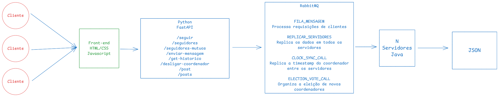

# Projeto Rede Social Distribuída - CC7261

## Integrantes

Gabriel Destro / 24.122.05-99

Enzo Pacheco Porfírio / 24.122.00-37

## Objetivo

Desenvolver um sistema distribuído de rede social que possibilite a interação entre usuários de forma escalável, tolerante a falhas e consistente, implementando:

* Publicação de textos (posts)
* Seguir usuários e exibição de feed com notificações
* Troca de mensagens privadas entre usuários mutuamente conectados
* Sincronização e replicação de dados em múltiplos servidores via RabbitMQ
* Consistência e ordenação garantidas por relógios lógicos
* Eleição de coordenador automática pelo algoritmo Bully

## Pré-requisitos

* Docker
* Docker Compose

## Instalação e Execução

```bash
git clone https://github.com/gabrieldestro56/projeto-final-RedeSocial/
cd projeto-final-RedeSocial
docker compose up --build
```

Após a inicialização:

* **Front-end** : [http://localhost:8080](http://localhost:8080/)
* **API** : [http://localhost:8000](http://localhost:8000/)
* **RabbitMQ (Management UI)** : [http://localhost:15672](http://localhost:15672/) (usuário: guest / senha: guest)

## Funcionalidades

* Login simples por nome de usuário
* Publicação de posts com timestamp
* Feed de posts ordenados por data, com botão de seguir diretamente no feed
* Notificações de novos posts de usuários seguidos
* Armazenamento local dos dados em arquivos JSON em cada servidor
* Replicação automática de dados entre servidores através do RabbitMQ (fila `FILA_MENSAGEM` e exchange `REPLICAR_SERVIDORES`)
* Sincronização periódica de relógios lógicos via exchange `CLOCK_SYNC_CALL`
* Tolerância a falhas: detecção de falha do coordenador em 10 segundos e eleição automática via Bully
* Chat privado entre usuários que se seguem mutuamente, com atualização a cada 5 segundos

## Endpoints da API

| Método | Rota                                   | Descrição                                           |
| ------- | -------------------------------------- | ----------------------------------------------------- |
| POST    | `/post`                              | Publica um novo post                                  |
| GET     | `/posts`                             | Retorna todos os posts                                |
| POST    | `/seguir`                            | Segue um usuário                                     |
| GET     | `/get-seguidores/{username}`         | Lista usuários que `{username}`segue               |
| GET     | `/seguidores-mutuos/{username}`      | Lista seguidores mútuos de `{username}`            |
| POST    | `/enviar-mensagem`                   | Envia mensagem privada                                |
| GET     | `/get-historico/{sender}/{receiver}` | Recupera histórico de mensagens                      |
| POST    | `/desligar-coordenador`              | Desliga o coordenador atual (para teste de eleição) |

## Arquitetura

O sistema é composto por:

1. **Cliente Web** (HTML/CSS/JS) servido via `http-server`
2. **API REST** (FastAPI) em Python, que expõe os endpoints e se comunica com o RabbitMQ
3. **RabbitMQ** como barramento de mensagens para RPC (`FILA_MENSAGEM`), replicação (`REPLICAR_SERVIDORES`) e sincronização de relógio (`CLOCK_SYNC_CALL`)
4. **Servidores Java** que processam as mensagens, atualizam o estado local (JSON + logs) e replicam atualizações
5. **Mecanismo de relógio lógico** e **algoritmo Bully** para eleição e sincronização de coordenador

## Diagramas de Arquitetura



# Documentação do Projeto Rede Social Distribuída

## Padrão de Mensagem

Todas as comunicações internas (API → RabbitMQ → Servidores Java) utilizam JSON no formato:

```json
{
  "operation": "nome_da_operacao",   // string identificadora
  "data": { … },                     // objeto com parâmetros
  "correlation_id": "UUID",          // UUID para correlação RPC
  "timestamp": "YYYY-MM-DD HH:MM:SS" // apenas em operações que incluem timestamp
}
```

| Operação                        | Campos de `data`                                                    |
| --------------------------------- | --------------------------------------------------------------------- |
| **criar_post**              | `username`(string)(string)<br />`timestamp`                       |
| **get_posts**               | *vazio*                                                             |
| **seguir**                  | `follower`(string)<br />`following`(string)                       |
| **get_seguidores**          | `username`(string)                                                  |
| **get_seguidores_em_comum** | `username`(string)                                                  |
| **enviar_mensagem**         | `sender`(string)<br />`receiver`(string)<br />`content`(string) |
| **get_historico**           | `sender`(string)(string)                                            |
| **desligar_coordenador**    | *`timestamp `*                                                    |

## Estrutura do Repositório

```
├── api/                 # API REST (FastAPI)
├── client/              # Front-end (HTML/CSS/JS)
├── server/              # Servidores Java, dados JSON e logs
├── docker-compose.yml   # Orquestração de containers
└── README.md            # Este arquivo
```

## Tecnologias Utilizadas

* **Python** (FastAPI, aio-pika)
* **Java** (RabbitMQ Client)
* **RabbitMQ** (fila, exchanges fanout)
* **Docker** & **Docker Compose**
* **Node.js** (http-server)
* **Bootstrap 5**

## Observações

* Os arquivos de dados e logs dos servidores ficam em `server/data`.
* A sincronização e eleição são automáticas; para testar, utilize o botão "Desligar Coordenador" algumas vezes no front-end.
* Os relógios indíviduais de cada servidor tem 15% de chance de se atrasarem em 1s, afim de testar a sincronização dos timestamps pelo coordenador.
